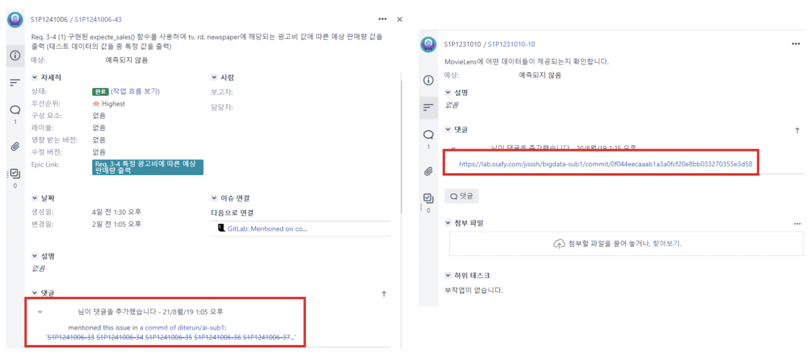
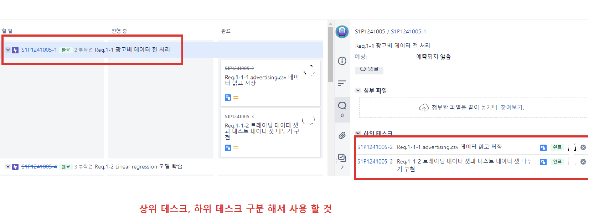

## git 과 jira

- commit message 에 날짜, 이름 등 불필요한 정보는 넣지 않습니다.
- 사용하지 않는 파일과 폴더는 과감히 삭제하세요. 어짜피 history에 저장되어 있습니다.
- 자동으로 생성되는 파일들은 gitignore에 추가하세요.
- Jira에서 task와 subtask를 구분해서 관리하세요.
- Jira issue 에는 git의 changed url 정보가 기록되어 있어야 합니다. 반대로 git commit 에는 해당 jira 이슈 번호가 기록되어 있어야 합니다.

