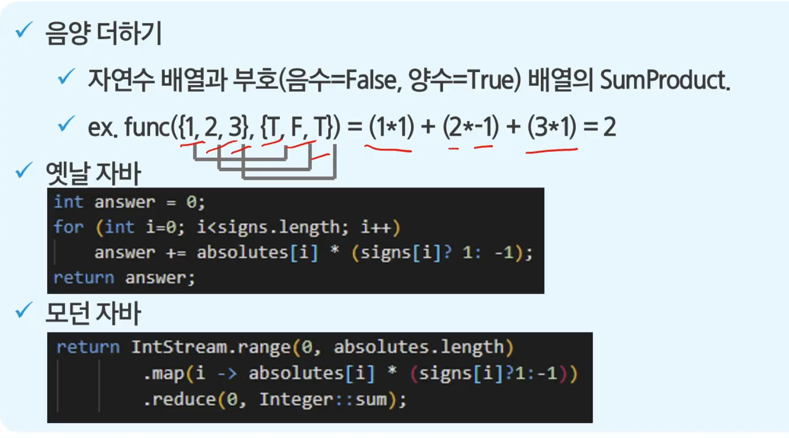
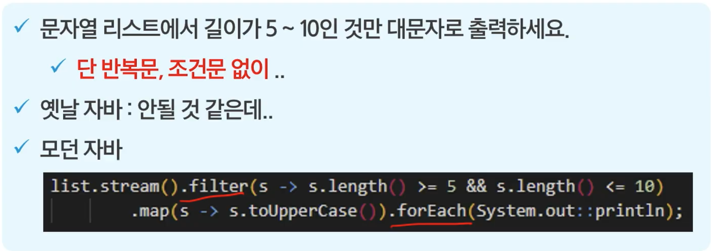
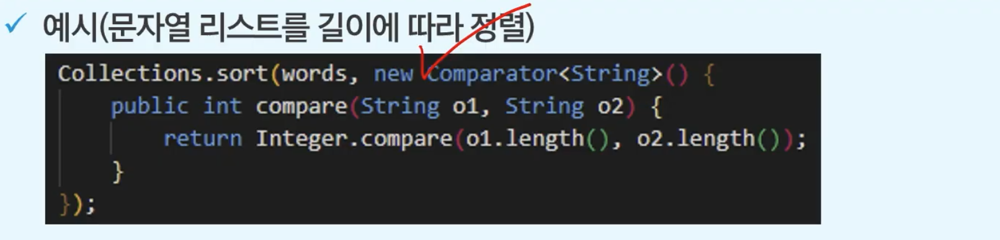
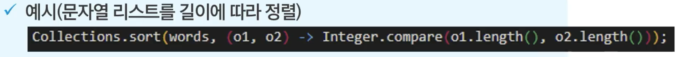
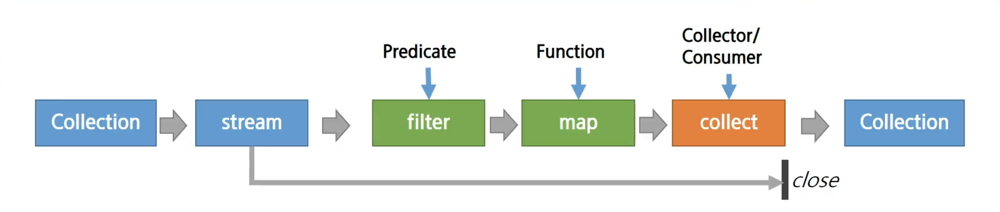
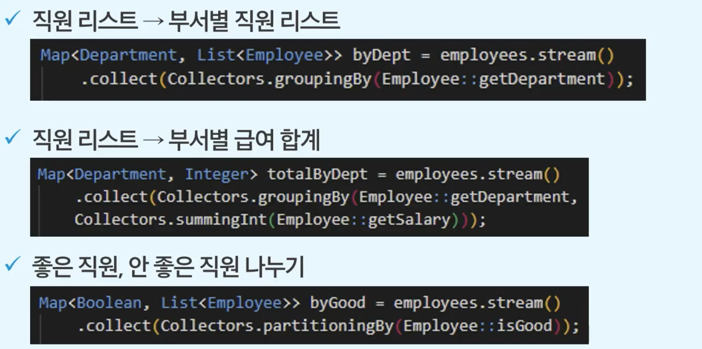
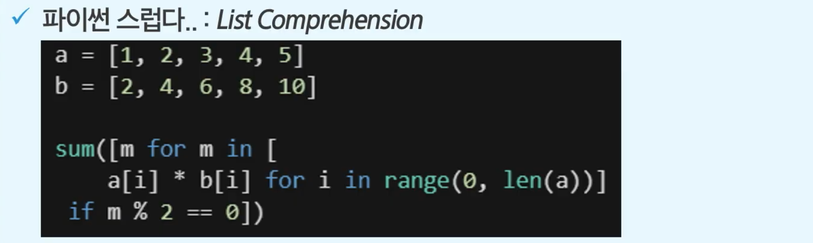
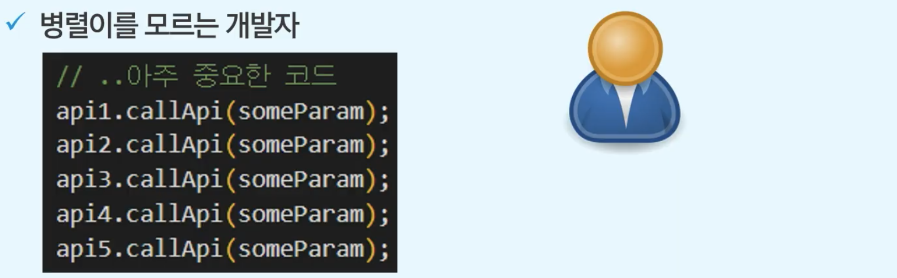
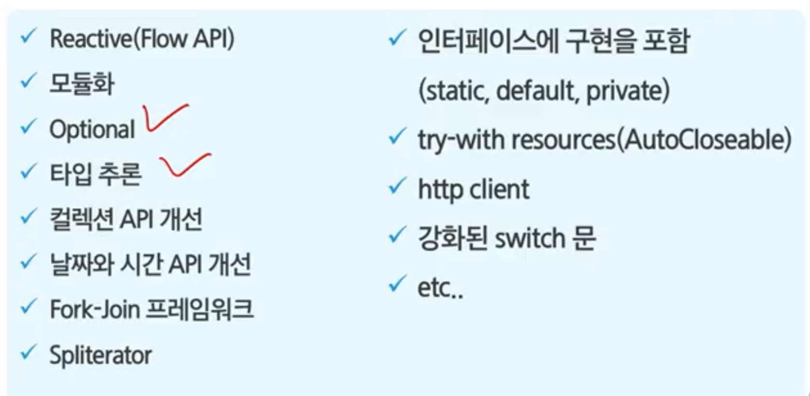

# Modern Java & Python

## modern java란?

함수형 프로그래밍 도입으로 큰 변화가 있었던 Java 8 이후를 의미

## Functional interface

함수형 패러다임 도입

### 함수형 언어란?

- 함수를 일급 시민(First Class Citizen)에 포함한다. 단, OOP를 깨지 않는다.
  - 일급 시민이면 함수를 변수에 넣을 수 있어야 하고, 매개 변수로 전달할 수 있어야하고, 리턴할 수 있어야 한다.

- 익명 클래스의 번거로움을 람다로 간편하게 
- 메서드 참조로 재사용
- 코드 블록을 주입(동작 파라미터화) 하고 조합(Pipeline) 할 수 있게 됨
- 스트림 기반이 되며 병렬 처리와 조화를 이룬다.

### 주요 패키지, 클래스

- @FunctionalInterfface
- java.util.function
- Consumer, Supplier, Function, Predicate
- Operator
- Int, Long, Double

## Lambda

### 람다란?

익명 함수로 익명 클래스를 대체한다.

### 예시

인터페이스인 Comparator를 내부 메서드로 구현

### Use Case

- Predicate : test 메서드, true/false 를 반환하는 경우
  - 조합 : and, or, not, negate
  - Use Case : 필터, 실행 결과만 확인할 때 / stream.filter
- Function : apply 메서드, 인자와 리턴 존재, 여러 용도로 사용
  - 조합 : andThen, compose
  - Use Case : 범용적 / stream.map
- Consumer : accept 메서드, 리턴이 없음, 최종 소비자일 때
  - 조합 : andThen
  - Use Case : 메세지 소비자, 처리기 / stream.forEach, peek
- Supplier : get 메서드, 인자 없음(리턴만)
  - Use Case : 메세지 생산, 조회, 실행 지연, 의존성 주입 / stream.collect, generate

## Stream API

### 스트림이란?

기존의 컬렉션에 함수형, 데이터처리 연산을 지원하도록 소스에서 추출된 연속된 요소

- 내부 순환 : VM 이 알아서 반복한다.
- SQL 처럼 선언형 스타일로 데이터를 처리
- 쉽게 병렬처리 적용 : paralleStream 메서드

### 주요 패키지, 클래스, 메서드

- java.util.stream
- BaseStream, Stream
- map(), filter(), reduce(), min(), ...
- C.stream(), C.parallelStream()

### 중간연산과 최종연산

- 중간 연산은 스트림을 반환하며 여러 연산을 조합할 수 있다.
- 최종 연산은 스트림을 모두 소비하고 닫는다.
- 스트림은 1회용이며 최종 연산 이후 사용이 불가하다.

### 예시

## 한편 파이썬은...

- ver 1.0 부터 함수형
- 내장 컬렉션(리스트, 맵, 튜플, 딕셔너리) 사용
- lambda, itertools, functions, generator

### 예시

map, filter를 직접 사용하지 않음.

## 쉬운 병렬처리(동시성) 도입 concurrent

- JENNITER 로 서버 모니터링

### 웹은 기본적으로 병렬구조(쓰레드)

그러나 저수준 병렬 처리는 어렵다.

- Thread, Lock, synchronized...

따라서 Java 에서 많이 사용되는 패턴들을 언어 차원에서 API로 지원

고수준, 추상화, Thread Safety, 비동기 지원

### 주요 패키지, 클래스

- java.util.concurrent
- Executor(s), ExecutorService
- xxThreadPool, ForkJoinPool
- Future, Completable Future
- Runnable, Callable

### Executor, Service, Etc

- Thread를 직접 생성, 관리하지 않고 ExecutorService에서 스레드를 관리
- 작업(Runnable, Callable)을 Executor 서비스에 요청하고 결과 받기
- 작업 스케쥴링(cron, at) 기능 : ScheduledExecutorService
- Concurrent Collection
  - Thread Save 한 List와 Map 제공
- Atomic Variable
  - 변수 자체가 원자성을 보장
- Lock 객체
  - 동기화 패턴에 따라 사용할 수 있는 유틸리티

### 비동기 지원(Async)

- Process A 가 Process B 를 호출한 후 기다리면 동기, 기다리지 않고 자기 일을 하면 비동기
- Future 인터페이스 : 비동기 연산 지원, 완료 확인, 대기, 결과조회 및 취소
- CompletableFuture : Future 작업 연결, 순서 정의 등

### 예제

- 상황 : 하나에 3초정도 걸리는 API 5개를 호출해야 한다.
- 문제 : 10초 이상 대기하면 사용자가 도망간다.
- 해결 : 병렬로 여러 API 호출을 실행한다.

4 개를 한번에 호출한다.

## 