# REST API

## RestAPI

### SQL

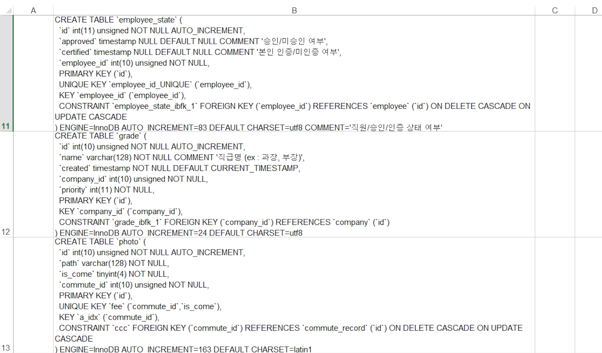


### Query-RestApi

RestApi 쿼리문도 작성해봅시다.

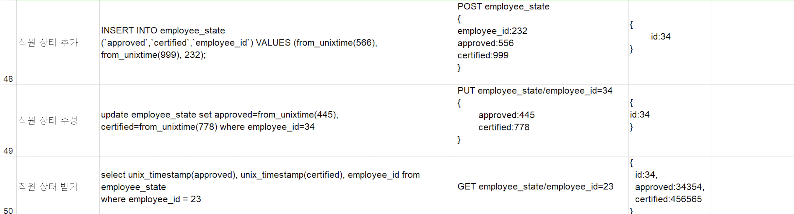


### Use INT, not BIGINT

INT 썼다가 BIGINT 로 바꾸기는 쉽지 않습니다. 애초에 INT 를 쓰면 됩니다. BIGINT 는 40 이상의 숫자입니다. 유저테이블의 id 가 40억이 넘을까요?  더 큰 타입을 쓰게되면 처리속도가 느려질 뿐입니다.

SMALLINT 는 어떨까요? 속도적으로 큰 이득을 볼 수는 없습니다.

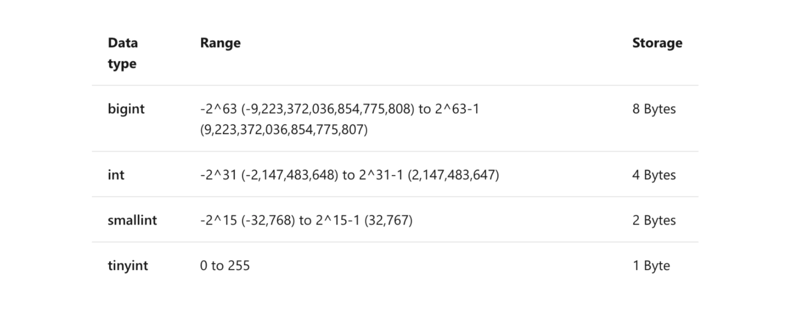

### 반환할 데이터가 없는 경우

API를 호출할였을대 반환할 데이터가 없을 때 다음과 같이 오류코드와 데이터를 반환하면 안됩니다.

```
code : 404 body{ msg : "no comments" }
```

왜냐하면 반환할 데이터가 없는 것은 오류 상황이 아니기 때문입니다.

대신에 다음과 같이 반환해야 합니다.

```
code : 200 body:[]
```


### URL 에 메서드의 의미를 담읍시다.

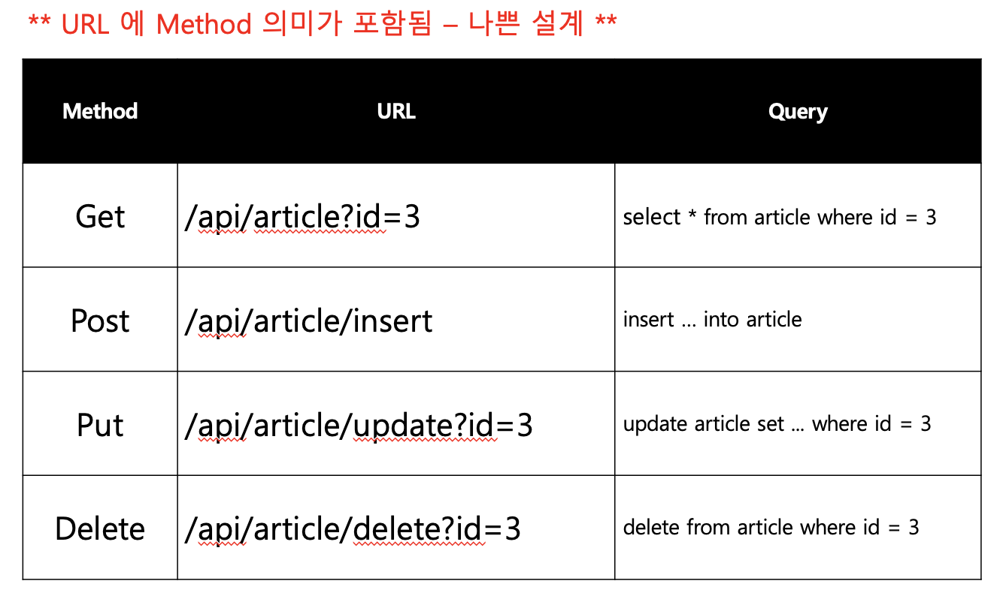

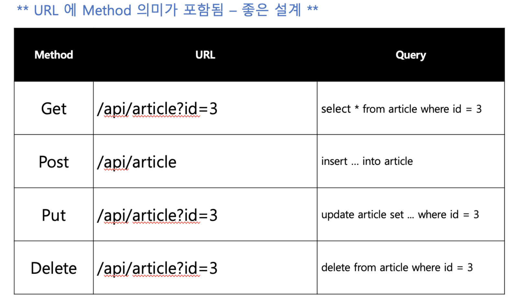


### 파라미터는 조건입니다.

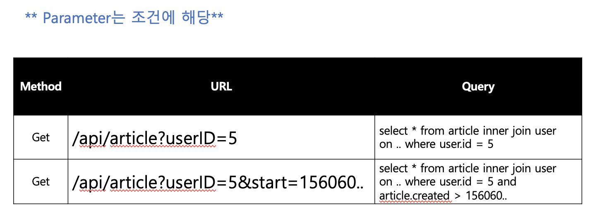


### 모든 값을 가져올 경우에는 파라미터가 없으면 됩니다.

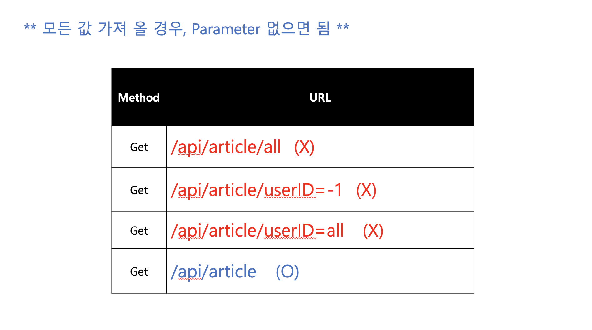


### 성공/실패 여부

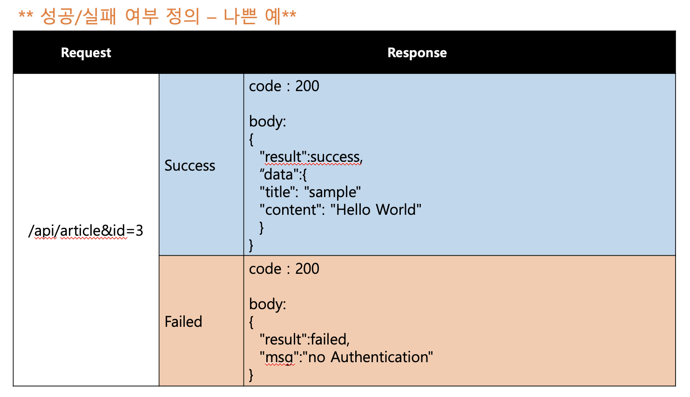

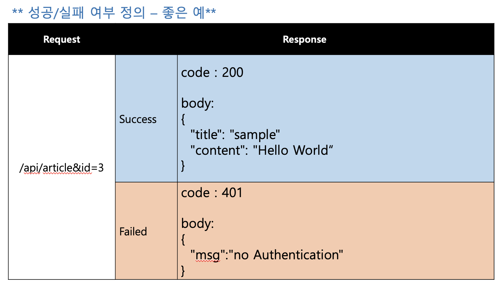


### REST API 설계와 SOLID 원칙

1개의 게시글에 여러개의 댓글이 달리는 경우 REST API 설계를 어떻게 하는것이 좋을까요?

1. 게시글과 댓글등 모든 정보를 모두 한번에 보내는 방법
2. 게시글의 정보/작성자의 정보/게시글의 댓글들, 3개로 나누어 보내는 방법

두 가지가 있을 것입니다.

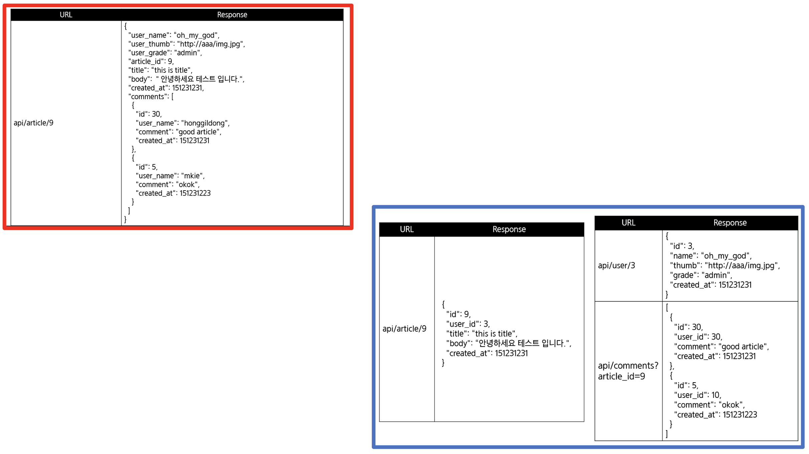

1번의 경우 속도가 빠르지만, 재사용성이 낮습니다(개발 속도가 느리다).

2번의 경우 속도가 느리지만, 재사용성이 좋습니다(개발 속도가 빠르다).

SOLID 원칙에서 단일 책임 원칙과 인터페이스 분리 원칙에 대한 이야기죠.


### 객체지향 5대 원칙 SOLID

- SRP 단일책임: 하나의 설계 부품(클래스 등등)은 하나의 기능/책임

- OCP 개방 폐쇄 : 확장에는 열려있고, 수정에는 닫혀있어야 한다. ⇒ 수정없이 기능을 추가할 수 있도록 설계해야 한다.

- LSP 리스코프 치환 : => 자식 클래스는 언제나 부모 클래스를 대체할 수 있어야한다. 자식 클래스는 부모 클래스의 책임(제약사항)을 무시하거나 재정의하면 안된다.

- DIP 의존 역전 : 의존 관계를 맺을 때 변화하기 쉬운것(구체적인 클래스)보다 변화가 없는것(인터페이스, 추상 클래스)에 의존하라.

- ISP 인터페이스 분리: 한 클래스는 자신이 사용하지 않는 인터페이스는 구현하지 말아야한다. 하나의 일반적인 인터페이스보다 **여러개의 구체적인 인터페이스**가 좋다.


## key 로는 varchar 보다 정수(int) 를 사용합시다.

VARCHAR can hold WHILE SPACE. They take up more space and are likely to slower when doing a Queries. 

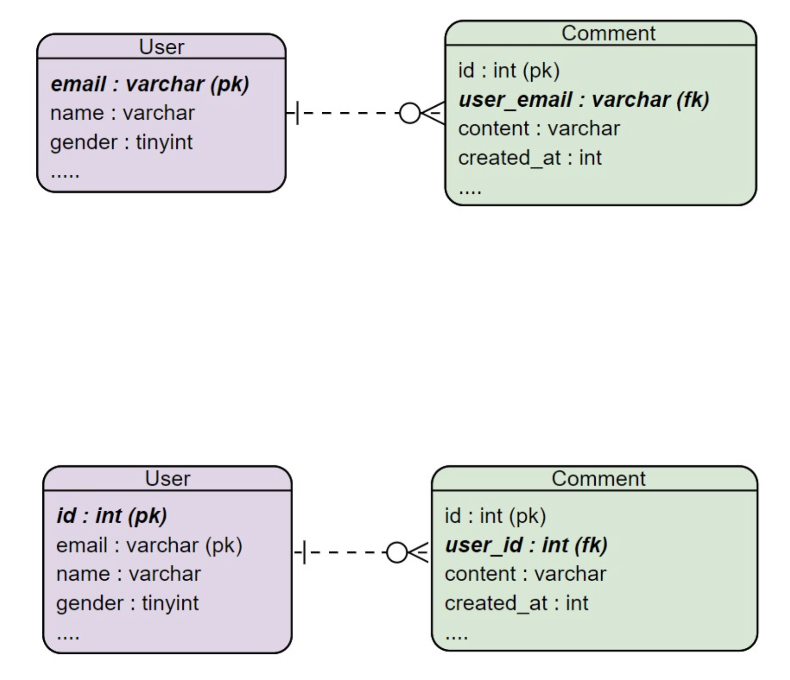


## 데이터 정규화

### 테이블 내에서 불필요한 컬럼을 정리해봅시다.

예를 들어 complete_data 와 complete 은 함께 있을 필요가 없습니다. complete_date 가 not null 인지 null 인지에 따라 complete 가 결정되기 때문입니다.

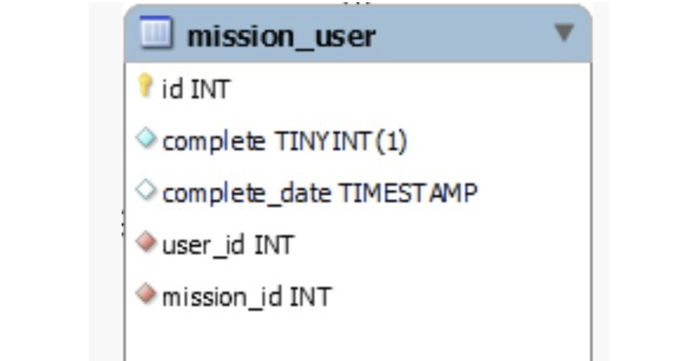


### 테이블에 컬럼이 많아지면 1:1 분리를 고려합시다.

컬럼이 많아지면 DB 속도도 느려지고, 네이밍도 어려워 관리하기 점점 어려워집니다. 

한 테이블에 컬럼이 7개를 넘어가면 모듈화가 잘 안되어 있다는 위험 신호입니다.

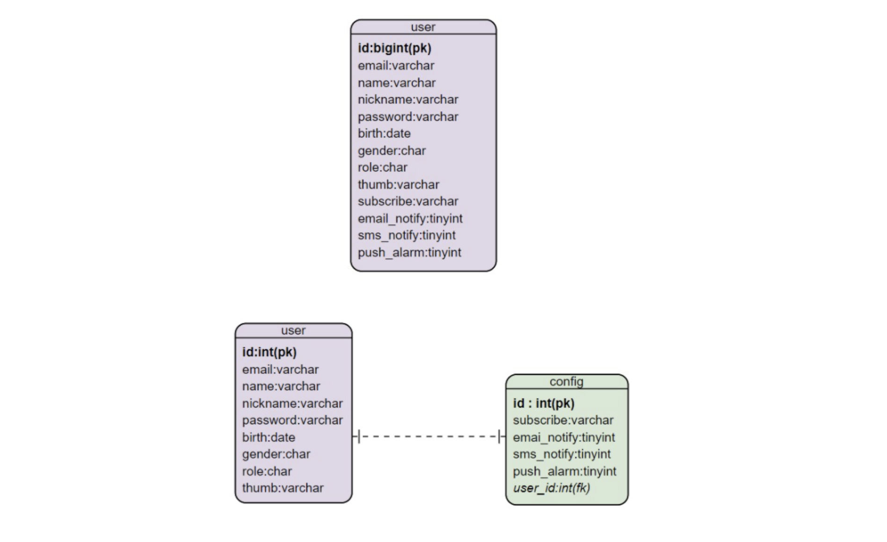